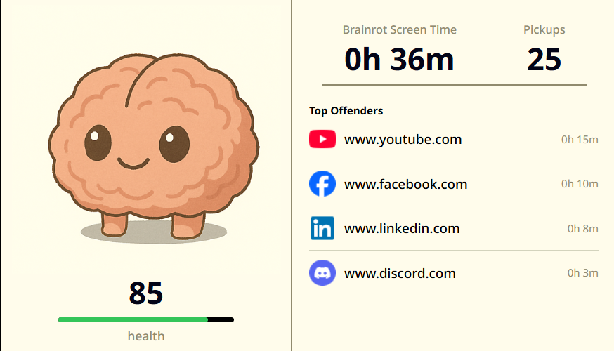
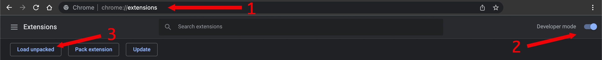

# Brainrot

Brainrot is an extension for Chrome, inspired by [Brainrot](https://thebrainrotapp.com/)

## Screenshot

Here's what Brainrot looks like in your browser:

## How It Works

Once installed, Brainrot tracks how much time you spend on different websites, highlights your top distractions, and helps you become more aware of your screen time.

## Installation guide

1) Git clone or download file and unzip on a folder.
2) Go to the extensions tab on [Google Chrome](chrome://extensions/).
3) Enable "Developer Mode" on the top right of the tab.
4) Press on "Load unpacked" new feature that appeared on top left corner.
5) Browse the path you downloaded the extension and choose select.
6) Enjoy ;)

